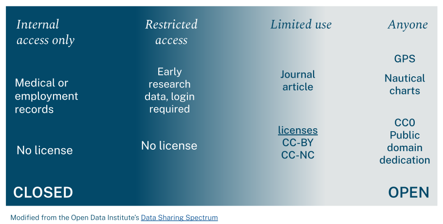

### What is it? 

*Data licenses contain the terms under which you can use someone else's data.*  

 

::: {.commentbox}
::::{.commentbox-header}
Lesson Slides
::::
::::{.commentbox-body}
The [Data Sharing & Licensing Lesson](https://doi.org/10.5281/zenodo.21417761).
::::
:::
 
 

### Data Sharing spectrum

 

### Additional resources

See the [Data Licensing](resources.qmd#Data Licensing) section of the Additional Resources page for more information. 
 