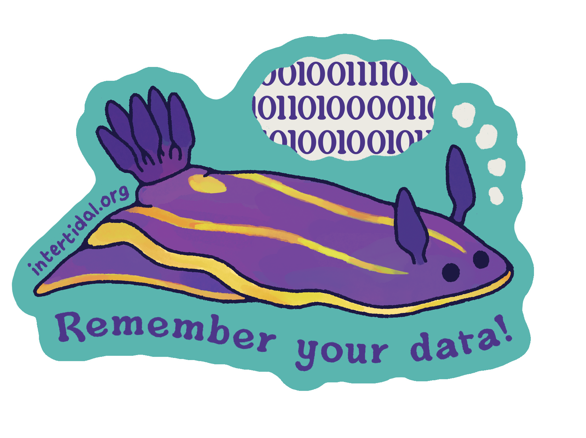

 

Ocean data is critical for the science, innovation, and management we need for a livable planet, but too often data is not easily accessible or usable in a trustworthy way. Unlocking ocean data does not require a technology solution, especially when the global data landscape is rapidly changing.  Rather, the solution is ***supporting the people who*** apply expertise, judgment, and skill to ***connect data to action*** throughout the data lifecycle.  This is called ***ocean data stewardship***, and we think it's an essential superpower.

 

Data stewardship is a proactive mindset that makes data actionable. Data stewards improve the value and impact of ocean data by practicing stewardship throughout the data lifecycle. By treating data as a community asset, ocean data stewards increase the reach of data beyond any single project and expand the body of knowledge available to everyone.

 

### Why is data stewardship important?  

*TLDR: It saves time and money, and increases data impact.*  

Data stewardship practices and actions ensure data quality and integrity, maximize reusability, support innovation, and increase transparency.  Data that are properly stewarded protect privacy where appropriate, foster ethical use and reuse, and compliance with regulations.  This is why proactive data stewardship is critical and cannot be the task of one person, but rather must be a shared goal across an entire organization.

 

### Stay in touch with us!

Intertidal Agency's [Ocean Data Stewardship training program](training-program.qmd) seeks to build a global community of ocean data stewards who are active in making ocean data more reusable and used for action.  Come join our community and build your data stewardship superpowers!

Have a question or want to be notified of future trainings? [Contact us about data stewardship.](https://forms.gle/jLG6dm1EBXGA2hhx8)  

Want to hear more about what Intertidal does?  Subscribe to the [Intertidal Newsletter!](https://buttondown.email/intertidalagency)

  

 
